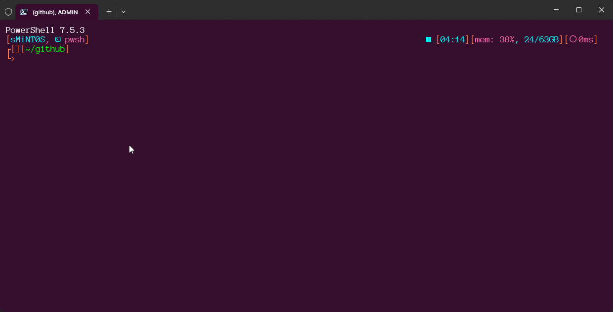
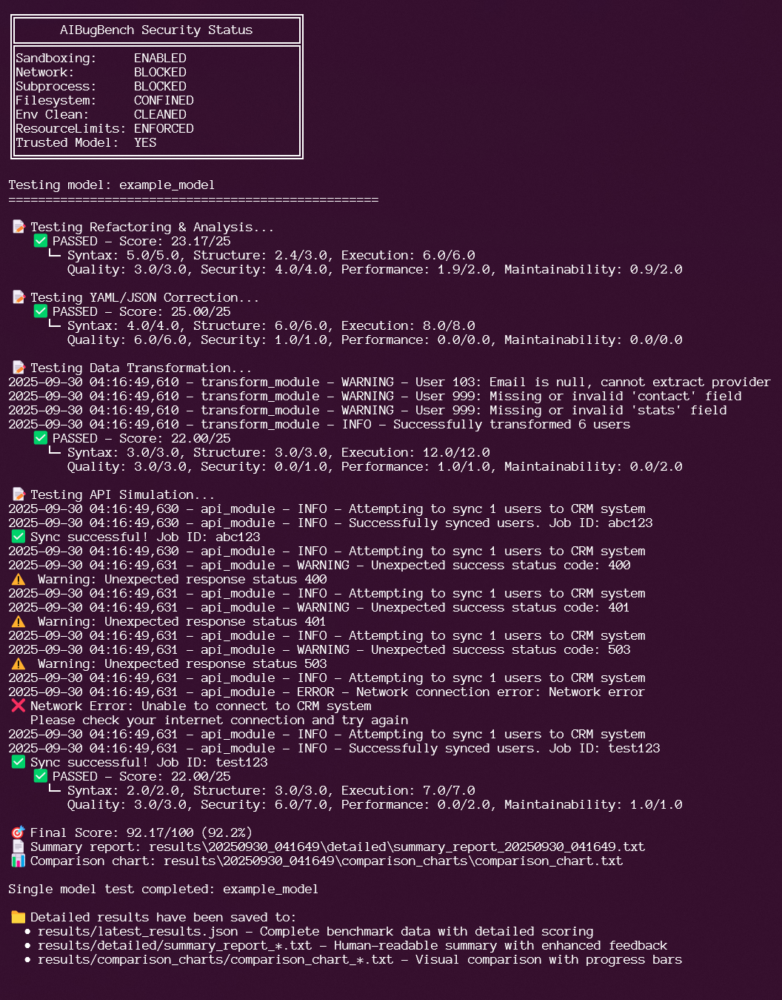

# AIBugBench

[](https://sMiNT0S.github.io/AIBugBench/)
[](https://github.com/sMiNT0S/AIBugBench/actions/workflows/ci.yml)
[](https://codecov.io/github/smint0s/aibugbench)


📚 **[Complete Documentation](https://sMiNT0S.github.io/AIBugBench/)** | [Getting Started](https://sMiNT0S.github.io/AIBugBench/getting-started/) | [Security](https://sMiNT0S.github.io/AIBugBench/security/)

---

## What is AIBugBench?

Compare AI models on the **same four tasks**. Score across **seven dimensions**. Local, sandboxed, deterministic. No vibes—just receipts.

Perfect for choosing between models, catching regressions, and understanding how LLMs handle messy code under controlled conditions.

**What you get:**

- Fixed prompts + deterministic fixtures = comparable results across models and runs
- Seven-dimension scorecard: correctness, safety, readability, efficiency, robustness, portability, maintainability
- Sandboxed local execution (no cloud dependencies, no network calls by default)
- Results you can diff, track, and reproduce

**Not included:**

- Whole-codebase scanning (it's a benchmark, not a production tool)
- Magic prompt tuning for your app
- Security blessing for arbitrary code

Use AIBugBench to compare models and monitor behavior over time, not to validate production systems.

---

## Quick Start (60 seconds)



### Prerequisites

- Python 3.13+
- Git

### Installation & First Run

**Windows PowerShell:**

```powershell
git clone https://github.com/sMiNT0S/AIBugBench.git
cd AIBugBench
python -m venv venv
venv\Scripts\Activate.ps1
pip install -r requirements.lock
python run_benchmark.py --model example_model
```

**macOS/Linux Bash:**

```bash
git clone https://github.com/sMiNT0S/AIBugBench.git
cd AIBugBench
python3 -m venv venv
source venv/bin/activate
pip install -r requirements.lock
python run_benchmark.py --model example_model
```

Expected result: ~90/100 (A grade) in under a minute.



---

## Documentation

📚 **[Complete Documentation](https://sMiNT0S.github.io/AIBugBench/)** - Full guides, API reference, and examples

**Quick Links:**

- 🚀 [Getting Started](https://sMiNT0S.github.io/AIBugBench/getting-started/) - Setup and first benchmark
- 📖 [User Guide](https://sMiNT0S.github.io/AIBugBench/user-guide/) - Running benchmarks and interpreting results
- 👨‍💻 [Developer Guide](https://sMiNT0S.github.io/AIBugBench/developer-guide/) - Adding and testing AI models
- 🔒 [Security](https://sMiNT0S.github.io/AIBugBench/security/) - Sandbox architecture and threat model
- 🏗️ [Architecture](https://sMiNT0S.github.io/AIBugBench/architecture/) - Technical design and components
- 📊 [Scoring Methodology](https://sMiNT0S.github.io/AIBugBench/scoring-methodology/) - How models are evaluated
- 🔧 [Troubleshooting](https://sMiNT0S.github.io/AIBugBench/troubleshooting/) - Common issues and solutions
- 🤝 [Contributing](https://sMiNT0S.github.io/AIBugBench/contributing/) - Development and contribution guide

---

## Requirements & License

**Requirements:** Python 3.13+ • pyyaml>=6.0 • requests>=2.25.0
**License:** [Apache-2.0](LICENSE)
