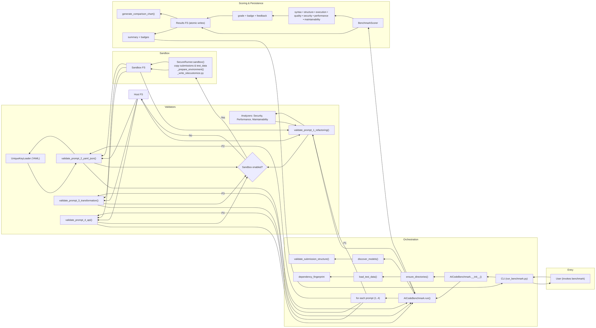

<!-- markdownlint-disable MD046 -->
<!-- markdownlint-disable MD033 -->
# Architecture

Technical overview of AIBugBench's design, components, and implementation patterns.

## System Overview

AIBugBench is a Python-based benchmarking framework designed to evaluate AI model code generation capabilities across multiple quality dimensions. The system uses a modular architecture with clear separation between test data generation, submission handling, validation logic, and scoring mechanisms.

### High-Level Architecture

#### Sequence: Entry & orchestration

```sequence
sequenceDiagram
        autonumber
        participant U as User
        participant CLI as CLI
        participant R as Runner
        participant F as Factory

        U->>CLI: run_benchmark(model)
        CLI->>R: build runner / resolve paths
        R->>F: make_validator("p1")
        F-->>R: Prompt1Validator
```

_Prompt 2 now runs on the modular validation stack (p1 and p2 share the new factory), while the remaining prompts stay on the legacy adapter until their refactors ship._

Next → Analysis & sandbox

#### Sequence: Analysis & sandbox

```sequence
sequenceDiagram
        autonumber
        participant R as Runner
        participant V1 as P1 Validator
        participant SR as SecureRunner
        participant SB as Sandbox FS
    participant A as Analyzers (security/performance/maintainability scoring)

        R->>V1: analyze(run_dir)
        alt sandbox enabled
            V1->>SR: sandbox(model)
            SR->>SB: setup env & dirs
            SR-->>V1: with sandbox
        else unsafe mode
            V1->>V1: run on host
        end
        V1->>A: run checks
        A-->>V1: checks[], stats{}
        V1-->>R: analysis
```

← Previous: Entry & orchestration • Next → Scoring, persistence, and return

#### Sequence: Scoring, persistence, and return

```sequence
sequenceDiagram
        autonumber
        participant R as Runner
        participant S as Scoring
        participant FS as Results FS
        participant CLI as CLI
        participant U as User

        R->>S: score(analysis)
        S-->>R: totals
        R->>FS: write results (atomic)
        R-->>CLI: summary + badges
        CLI-->>U: pass/fail + locations
```

← Previous: Analysis & sandbox

### Flowcharts

#### Flowchart: Full process



??? details "Mapping notes (what each box maps to, and why)"
    **Entry & Orchestration**
    - **CLI** → `run_benchmark.py`  
      Parses flags, builds the runner, prints the security banner, and kicks off the prompt loop.
    - **Runner** → orchestrates prompt validators, hands analysis to scoring, writes results.

    **Sandbox layer**
    - **SecureRunner.sandbox()** → creates an isolated temp root; writes `sitecustomize.py`; rebuilds env vars  
      `HOME`, `TMP*`, `PYTHONDONTWRITEBYTECODE=1`, `AIBUGBENCH_ALLOW_NETWORK=0/1`.
    - **run_python_sandboxed(...)** → executes Python inside the sandbox with resource caps and stdout capture.
    - **Unsafe path** → when `--unsafe` or `AIBUGBENCH_UNSAFE=1`, validators run on host FS (guards relaxed).

    **Prompt 1 (migrated path)**
    - **Prompt1Validator.analyze(...)** → runs staged checks, calls analyzers  
      security/performance/maintainability, returns a structured `analysis` dict + artifacts.
    - Mid-migration prompts follow the legacy adapter until their validators move to this stack.

    **Scoring**
    - **BenchmarkScorer** → computes seven category scores  
      syntax, structure, execution, quality, security, performance, maintainability; returns detailed + total.

    **Persistence & artifacts**
    - **Atomic writes** → results JSON and summaries written via `*.tmp` then `os.replace`.  
      Artifacts: run JSON, summary text, charts, any per-prompt attachments.

    **Flags that change flow**
    - `--unsafe` → skip sandbox; run on host.  
    - `--allow-network` → allow network inside sandbox.  
    - `--mem {256..1024}` → memory cap for sandboxed runs.  
    - `--trusted-model` → suppresses unsafe-mode confirmation (CI convenience).

## Component Design

### Core Components

#### 1. Setup System (`scripts/bootstrap_repo.py`)

Responsible for generating test data with intentional sabotage patterns:

```python
class SabotageGenerator:
    """Creates deliberately broken test files with specific bug patterns."""
    
    def generate_yaml_errors(self):
        # Mixed indentation, type confusion, invalid syntax
        
    def generate_python_bugs(self):
        # Logic errors, security vulnerabilities, inefficiencies
        
    def generate_json_issues(self):
        # Format errors, type mismatches, structural problems
```

**Key Features:**

- Reproducible sabotage patterns
- Platform-agnostic file generation
- AI context file creation (`ai_prompt.md`)

#### 2. Runner Module (`benchmark/runner.py`)

Orchestrates benchmark execution and result aggregation:

```python
class BenchmarkRunner:
    def __init__(self, model_name: str, results_dir: str = "results/"):
        self.model_name = model_name
        self.results_dir = Path(results_dir)
        self.validators = self._load_validators()
        
    def run_all_tests(self) -> Dict[str, Any]:
        """Execute all prompts and aggregate results."""
        
    def _handle_timeout(self, func, timeout: int):
        """Wrap validation functions with timeout protection."""
        
    def _save_results(self, results: Dict[str, Any]):
        """Persist results in multiple formats."""
```

**Responsibilities:**

- Model discovery and loading
- Test execution orchestration
- Timeout management
- Result persistence

See [Benchmark Execution Flow](#benchmark-execution-flow) for detailed step-by-step orchestration.

#### 3. Validation Engine (`benchmark/validators.py`)

Implements prompt-specific validation logic:

```python
class PromptValidator:
    """Base class for prompt validation with 7-category assessment."""

    def validate_syntax(self, file_path: str) -> ValidationResult:
        """Syntax validation: Parse checking and import verification.

        Ensures code is syntactically valid Python and imports are resolvable.
        """

    def validate_structure(self, file_path: str) -> ValidationResult:
        """Structure validation: Function signatures and required components.

        Verifies expected functions, classes, and interfaces are present and correct.
        """

    def validate_execution(self, file_path: str) -> ValidationResult:
        """Execution testing: Runtime behavior and output correctness.

        Runs code against test cases and validates outputs match expectations.
        """

    def analyze_quality(self, code: str) -> QualityAnalysis:
        """Quality assessment: Code patterns and best practices.

        Evaluates adherence to Python idioms, PEP standards, and general code quality.
        """

    def analyze_security(self, code: str) -> SecurityAnalysis:
        """Security analysis: Vulnerability detection and unsafe patterns.

        Implements patterns described in Security Model section.
        """

    def analyze_performance(self, code: str) -> PerformanceAnalysis:
        """Performance analysis: Algorithm efficiency and resource usage.

        Identifies inefficient algorithms, excessive memory usage, and bottlenecks.
        """

    def analyze_maintainability(self, code: str) -> MaintainabilityAnalysis:
        """Maintainability analysis: Code complexity, duplication, and naming.

        Assesses cyclomatic complexity, code duplication, and identifier clarity.
        """
```

#### 4. Scoring Engine (`benchmark/scoring.py`)

Implements the 7-category scoring system:

```python
class ScoringEngine:
    """Calculate scores based on validation results."""
    
    SCORING_WEIGHTS = {
        'prompt_1': {
            'syntax': 5,
            'structure': 3,
            'execution': 6,
            'quality': 3,
            'security': 4,
            'performance': 2,
            'maintainability': 2
        },
        # Additional prompt weights...
    }
    
    def calculate_score(self, validation_result: Dict) -> Score:
        """Apply weighted scoring to validation results."""
        
    def determine_grade(self, total_score: float) -> str:
        """Map numerical score to letter grade."""
```

**Note:** Each prompt totals 25 points distributed across the 7 validation categories to ensure consistent scoring across different complexity levels.

#### 5. Utility Layer (`benchmark/utils.py`)

Common functionality and helper functions:

```python
class BenchmarkUtils:
    @staticmethod
    def safe_load_json(file_path: str) -> Optional[Dict]:
        """Load JSON with comprehensive error handling."""
        
    @staticmethod
    def safe_load_yaml(file_path: str) -> Optional[Dict]:
        """Load YAML safely without code execution."""
        
    @staticmethod
    def format_results(results: Dict) -> str:
        """Create human-readable result summaries."""
        
    @staticmethod
    def create_comparison_chart(results: List[Dict]) -> str:
        """Generate visual comparison charts."""
```

## Plugin Architecture

### Submission Structure

The tiered submission system supports multiple organizational patterns:
submissions/
├── reference_implementations/   # Verified reference solutions
│   └── example_model/
├── user_submissions/           # User-provided solutions
│   └── custom_model/
└── templates/                  # Starting templates
    └── template/

**Discovery Mechanism:**

1. Check `reference_implementations/` first
2. Fall back to `user_submissions/`
3. Finally check deprecated flat structure
4. Abort if ambiguous (model in multiple tiers)

### Adding Custom Validators

Extend validation for new prompt types:

```python
from benchmark.validators import BaseValidator

class CustomPromptValidator(BaseValidator):
    def validate(self, submission_path: str) -> ValidationResult:
        result = ValidationResult()
        
        # Custom validation logic
        result.add_check('custom_check', self.check_custom_requirement())
        
        return result
```

See [Extensibility Points](#extensibility-points) for information on custom validators and formatters.

## Testing Strategy

### Test Categories

1. **Unit Tests** (`tests/test_*_unit.py`)
   - Individual component testing
   - Mock external dependencies
   - Fast, isolated execution

2. **Integration Tests** (`tests/test_*_integration.py`)
   - Component interaction testing
   - Real file I/O operations
   - End-to-end workflows

3. **Security Tests** (`tests/test_security_*.py`)
   - Vulnerability scanning
   - Injection attack prevention
   - Safe parsing verification

4. **Performance Tests** (`tests/test_performance_*.py`)
   - Timeout enforcement
   - Memory usage monitoring
   - Algorithm efficiency validation

### Test Execution

```bash
# Run all tests
pytest

# Run with coverage
pytest --cov=benchmark --cov-report=html

# Run specific category
pytest tests/test_*_unit.py

# Run with markers
pytest -m "not slow"
```

## Security Model

High-level overview; see [Security](security.md) for full details and the authoritative threat model.

### Input Validation

All user inputs are validated before processing:

1. **File Path Validation**: Prevent directory traversal
2. **Code Execution Prevention**: No `eval()`, `exec()`, or `shell=True`
3. **YAML Safety**: Use `yaml.safe_load()` exclusively
4. **Timeout Protection**: Prevent infinite loops and DoS

### Sandboxing Strategy

- Isolated temp root with sanitized environment and paths.
- Resource caps with timeouts; deterministic execution (no import-time side effects).
- Strict guards against dangerous imports and execution primitives.

### Vulnerability Detection

Detectors cover unsafe execution, secrets, injection patterns, and traversal. See [Security](security.md) for the complete rule set and handling.

## Performance Optimization

### Caching Strategy

Results and intermediate data are cached:

```python
class ResultCache:
    def __init__(self, cache_dir: Path = Path(".cache")):
        self.cache_dir = cache_dir
        
    def get_or_compute(self, key: str, compute_func):
        """Return cached result or compute and cache."""
        
    def invalidate(self, pattern: str = "*"):
        """Clear cache entries matching pattern."""
```

### Parallel Execution

Support for concurrent model testing:

```python
from concurrent.futures import ProcessPoolExecutor

def test_models_parallel(model_names: List[str]):
    with ProcessPoolExecutor() as executor:
        futures = [
            executor.submit(test_single_model, name)
            for name in model_names
        ]
        results = [f.result() for f in futures]
    return results
```

## Data Flow

### Benchmark Execution Flow

The [Runner Module](#2-runner-module-benchmarkrunnerpy) orchestrates this flow:

1. User invokes: python run_benchmark.py --model X
                            │
2. Load submission files from submissions/X/
                            │
3. For each prompt (1-4):
   a. Load test data
   b. Validate syntax
   c. Check structure
   d. Execute code
   e. Analyze quality/security/performance
   f. Calculate score
                            │
4. Aggregate scores across prompts
                            │
5. Generate grade and feedback
                            │
6. Save results (atomic) to timestamped run directory.
   See [User Guide – Running Your First Benchmark](user-guide.md#running-your-first-benchmark) for the canonical results layout.

### Error Handling Flow

Try operation
     │
     ├─> Success: Continue to next step
     │
     └─> Failure:
           │
           ├─> Recoverable: Log warning, apply partial score
           │
           └─> Critical: Log error, return zero score, continue to next prompt

## Configuration Management

### Configuration Hierarchy

1. **Default Configuration** (hardcoded in modules)
2. **Environment Variables** (override defaults)
3. **Command Line Arguments** (highest priority)

```python
class ConfigManager:
    def get_config(self) -> Config:
        config = self.load_defaults()
        config.update(self.load_environment())
        config.update(self.parse_arguments())
        return config
```

## Extensibility Points

### Adding New Prompts

1. Create prompt file in `prompts/`
2. Add validator in `benchmark/validators.py`
3. Update scoring weights in `benchmark/scoring.py`
4. Add tests in `tests/`

### Custom Output Formats

```python
class CustomFormatter(BaseFormatter):
    def format(self, results: Dict) -> str:
        """Convert results to custom format."""
        
# Register formatter
FORMATTERS['custom'] = CustomFormatter()
```

### Integration Points

- **CI/CD Integration**: Exit codes, quiet mode, JSON output
- **IDE Integration**: Structured error messages, file paths
- **Web Service**: REST API wrapper possible
- **Database Storage**: Results can be persisted to DB

## Maintenance Patterns

### Version Management

```python
__version__ = "0.8.0"

def check_compatibility(submission_version: str) -> bool:
    """Verify submission compatibility with benchmark version."""
```

### Deprecation Handling

```python
def deprecated(message: str):
    """Decorator for deprecated functionality."""
    def decorator(func):
        @functools.wraps(func)
        def wrapper(*args, **kwargs):
            warnings.warn(message, DeprecationWarning)
            return func(*args, **kwargs)
        return wrapper
    return decorator
```

## Roadmap & Future Direction

### Current Release (0.x beta)

**Implemented Features:**

- Deterministic scoring & comparison output (timestamped results directories)
- Sandbox enforcement (process isolation helpers, filesystem guard, dynamic canaries)
- Resource limits (POSIX rlimits; Windows Job Objects when pywin32 available)
- Dynamic code / subprocess / dangerous import blocking
- Python-level network egress blocking (socket denial unless `--allow-network`)
- Strict environment whitelist (minimal allow-list rebuild of env)
- Hash-pinned dependency supply-chain integrity
- Security + dependency audit workflows

For implementation details, see [Security Model](#security-model) section.

### Committed Roadmap (tracked in ROADMAP.md)

**Near-term Planned Features:**

- Container / namespace isolation (bwrap / nsjail / docker) for defense-in-depth
- OS / kernel-level network isolation (firewall / namespaces) beyond Python socket guards
- SBOM + artifact signing for supply chain transparency
- Automated PR-tier sandbox fuzz stress harness
- Optional Semgrep ruleset integration for static analysis
- Public CodeQL adoption (post public repo / GHAS availability)

See [ROADMAP.md](ROADMAP.md) for detailed timelines and technical specifications.

### Long-term Vision (Exploratory)

**Product Features Under Consideration:**

- Web Dashboard for interactive result visualization and comparison
- Model Comparison Matrix with advanced statistical analysis
- Custom Challenge Creator UI for adding new prompts without code changes
- Cloud Execution capability for distributed testing at scale
- Real-time Monitoring with live progress tracking and notifications
- Advanced Analytics with ML-based pattern detection in model outputs

**Architecture Evolution Concepts:**

- Microservice decomposition for horizontal scalability
- Container-based execution for enhanced isolation
- Event-driven architecture for extensibility and integration
- GraphQL API for flexible data querying

_These are exploratory concepts and not committed features. Feedback welcome._

### Explicitly Out of Scope (Near-term)

- Multi-language model execution (Python-only focus)
- GPU / accelerator resource accounting
- Distributed execution orchestration

For rationale and long-term considerations, see [ROADMAP.md](ROADMAP.md).

## See Also

- **[Getting Started](getting-started.md)** - Setup and usage
- **[Developer Guide](developer-guide.md)** - Adding models
- **[API Reference](api-reference.md)** - Technical details
- **[Contributing](contributing.md)** - Development guidelines
